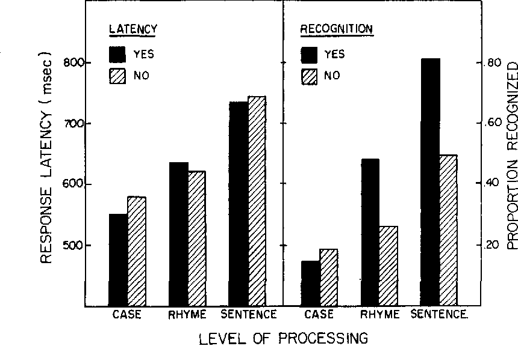
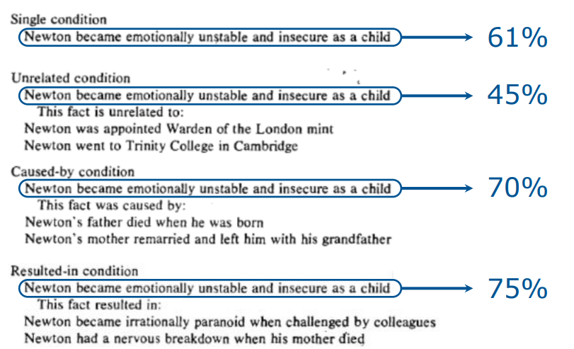
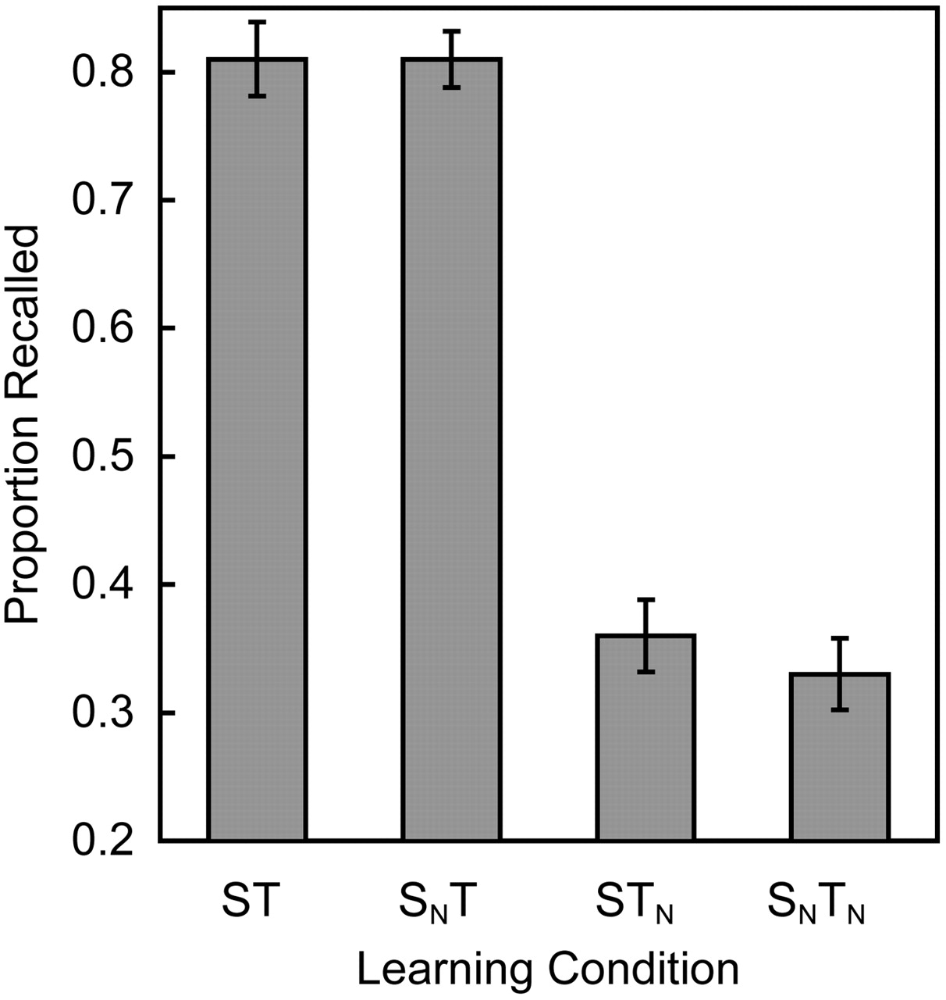
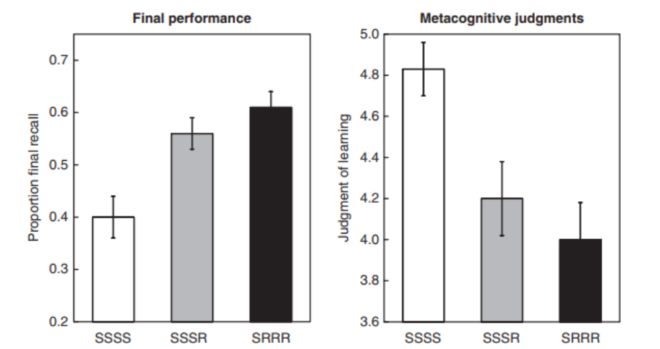
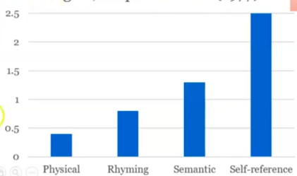

## How does depth of processing affect encoding in memory?
### Describe the experimental evidence.

David Theodor Nimrichtr 8. 5. 2026

---

### Positive correlation with depth, length, organisation

#### 
- Craik et al. 1972, 1975
- Bradshaw and Anderson 1982
- Karpicke Roedinger 2008
- Rogers et al.1977

---
### Craik et al.
- deeper processing

---
### Bradshaw & Anderson 1982
- longer and deeper processing

---
### Karpicke Roedinger
- rehersal 

---
### Karpicke Roedinger

- negative correlation in self-evaluation

---
### Rogers et al. 1977
- self

